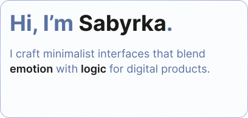
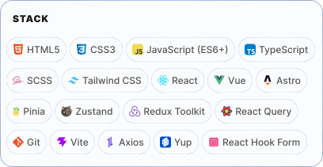

  <picture>
    <source media="(prefers-color-scheme: dark)" srcset="./images/header/header-dark.svg" />
    <source media="(prefers-color-scheme: light)" srcset="./images/header/header-light.svg" />
    
  </picture>

  <picture>
    <source media="(prefers-color-scheme: dark)" srcset="./images/about/about-dark.svg" />
    <source media="(prefers-color-scheme: light)" srcset="./images/about/about-light.svg" />
    
  </picture>

  <picture>
    <source media="(prefers-color-scheme: dark)" srcset="./images/stack/stack-dark.svg" />
    <source media="(prefers-color-scheme: light)" srcset="./images/stack/stack-light.svg" />
    
  </picture>

  <picture>
    <source media="(prefers-color-scheme: dark)" srcset="./images/connect/connect-dark.svg" />
    <source media="(prefers-color-scheme: light)" srcset="./images/connect/connect-light.svg" />
    
  </picture>

